# yocto building SOP for Basler cameras
簡單說明如何在 ubuntu 編譯 yocto, 並在 NXP iMX8M Plus 上使用 Basler camera.

`提醒 MIPI 相機接在 NXP iMX8M Plus 前需要有轉接板,` 如 [daA2500-60mc-IMX8-EVK](https://www.baslerweb.cn/zh-cn/shop/daa2500-60mc-imx8mp-evk/?sort=position).
`且安裝方式為凸面朝上如圖`.
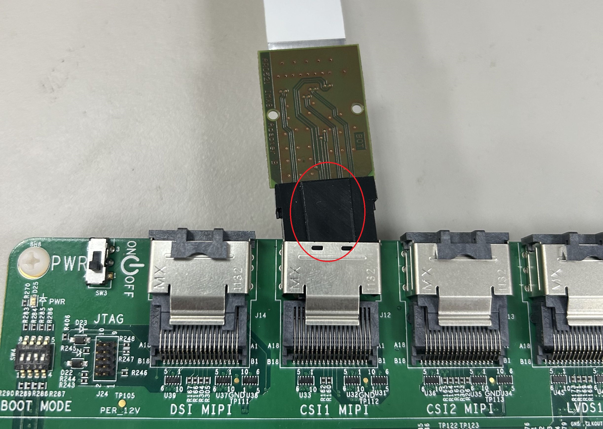
## OS Environment
* ubuntu version: 20.04
* Hard drive space: 500 gb 以上

## Preinstall before yocto compiling
皆下來安裝與操作皆以一般帳號即可, 不需要用到 root 權限.
### Libraries install
在 ubuntu 執行下列指令進行相關模組安裝.
```
sudo apt-get upgrade
```
```
sudo apt-get install gawk wget git diffstat unzip texinfo gcc-multilib build-essential chrpath socat cpio python3 python3-pip python3-pexpect xz-utils debianutils iputils-ping python3-git python3-jinja2 libegl1-mesa libsdl1.2-dev pylint xterm curl zstd liblz4-tool
```
### Git Setting
```
git config --global user.name "Edit your user name"
git config --global user.email "Edit your@mail.com"
```
### Repo install
```
cd ~
mkdir ~/bin
curl http://commondatastorage.googleapis.com/git-repo-downloads/repo > ~/bin/repo
chmod a+x ~/bin/repo
export PATH=~/bin:$PATH
```
## yocto compiling
因 Basler pylon 和 cameras 需要安裝 [meta-basler-tools](https://github.com/basler/meta-basler-tools) 與 [meta-basler-imx8](https://github.com/basler/meta-basler-imx8), 目前只支援到 5.15.71-2.2.0, 皆下來安裝會以前述版本進行.
* USB cameras: 需要安裝 meta-basler-tools.
* MIPI cameras: 需要安裝 meta-basler-imx, 選擇性安裝 meta-basler-tools, 但建議都裝.
### Create Folder
```
cd <anywhere>
mkdir yocto-project-name
cd yocto-project-name
```
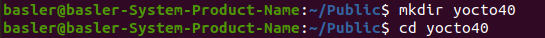
### nxp-imx download
```
repo init -u https://github.com/nxp-imx/imx-manifest -b imx-linux-kirkstone -m imx-5.15.71-2.2.0.xml
repo sync
```
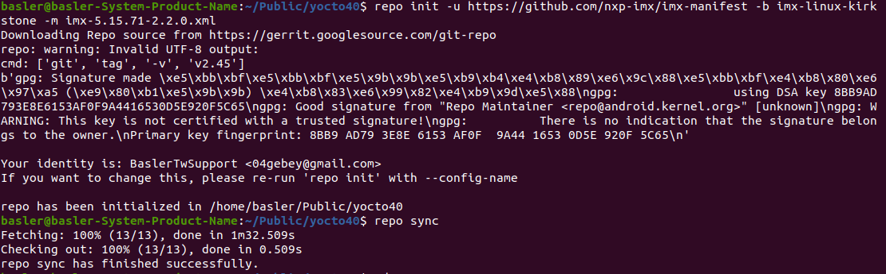
### Add the basler meta layers
```
cd yocto-project-name/sources
git clone --branch kirkstone https://github.com/basler/meta-basler-tools.git
git clone --branch kirkstone-5.15.71-2.2.0 https://github.com/basler/meta-basler-imx8.git
```
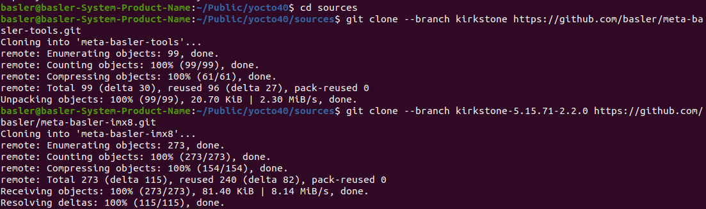
### BSP Environment setting
執行指令並讀完 license agreement 後, 輸入 `y` 後 enter 繼續.
```
cd yocto-project-name
DISTRO=fsl-imx-xwayland MACHINE=imx8mpevk source imx-setup-release.sh -b buildxwayland
```
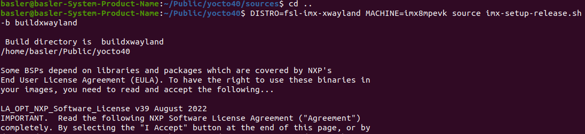
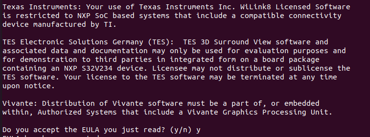
### Setting for MIPI camera
yocto-project-name/buildxwayland/conf/bblayers.conf 檔內加入以下參數.
```
BBLAYERS += "${BSPDIR}/sources/meta-basler-imx8"
BBLAYERS += "${BSPDIR}/sources/meta-basler-tools"
``` 
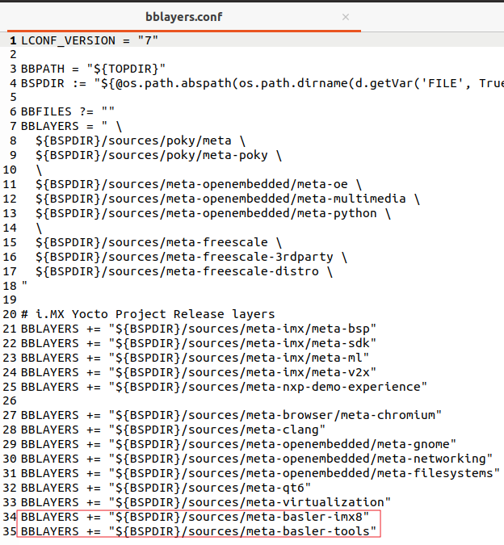

yocto-project-name/buildxwayland/conf/local.conf 檔內加入以下參數.
```
ACCEPT_BASLER_EULA = "1"
IMAGE_INSTALL:append = "packagegroup-dart-bcon-mipi"
```
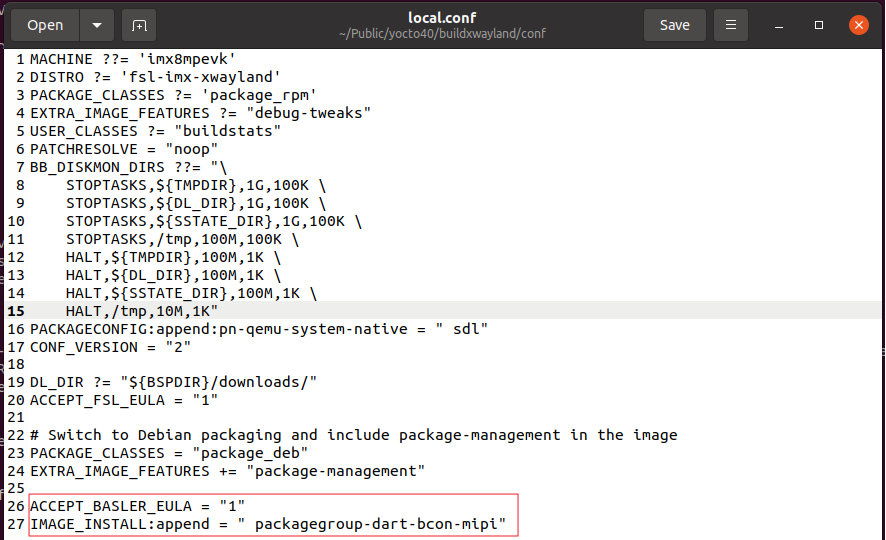
### BSP Compiling
執行前確認網路是否穩定, 建議接上有線或高速網路.
下列指令為簡易測試, 確認相機是否可控制.
```
cd yocto-project-name
bitbake imx-image-multimedia
```
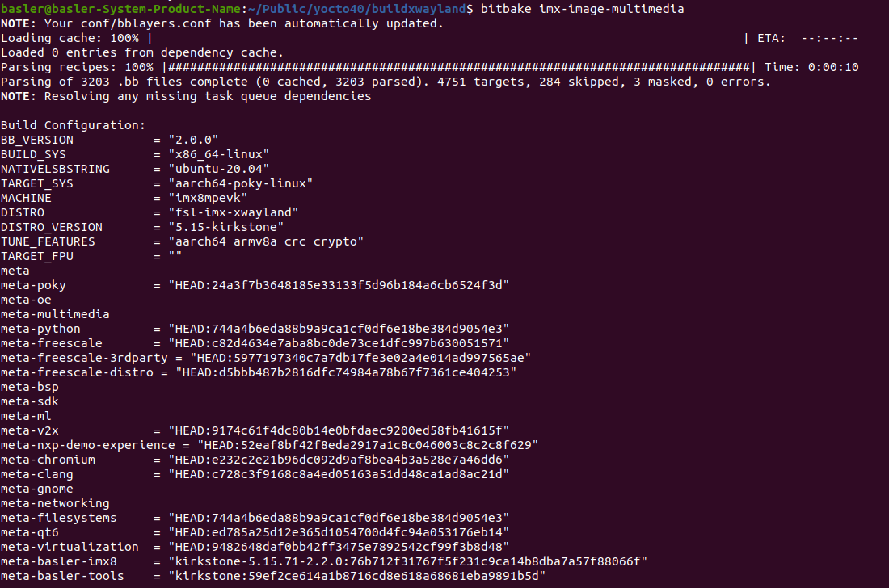
需要 machine learning 則執行以下指令.
```
cd yocto-project-name
bitbake imx-image-full
```
執行過程為數小時以上, 編譯成功畫面如下圖, 
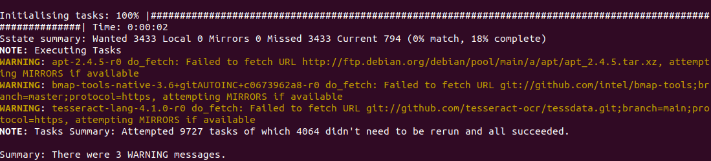
且在 yocto-project-name/buildxwayland/tmp/deploy 會有資料夾 images/imx8mpevk 存在.
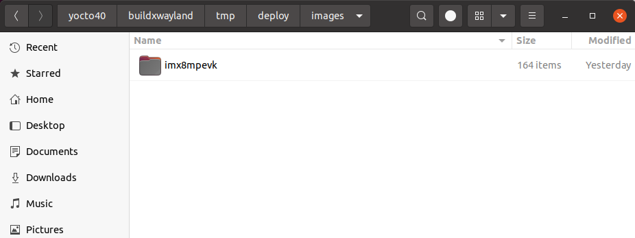
### Compiling Errors
編譯過程比較常出現因網路問題造成 Fetcher failure 而使得編譯失敗.
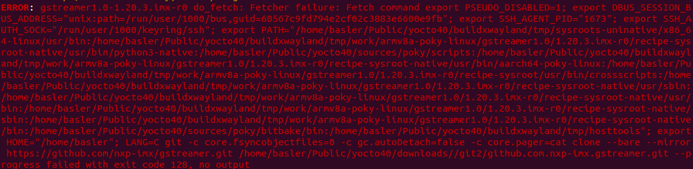
編譯失敗而中斷會顯示因那些模組失敗, 需要針對個別模組重新編譯.
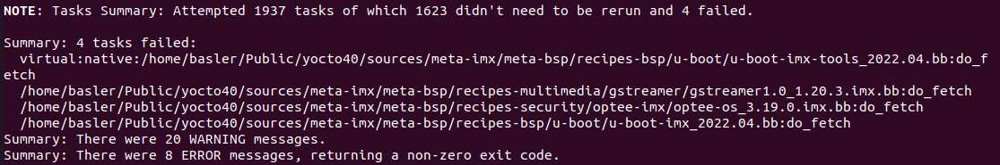
```
bitbake gstreamer1.0 -c clean 
```
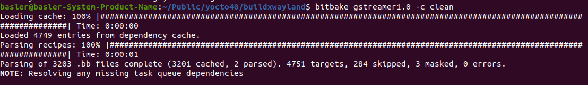
```
bitbake gstreamer1.0 -c compile 
```
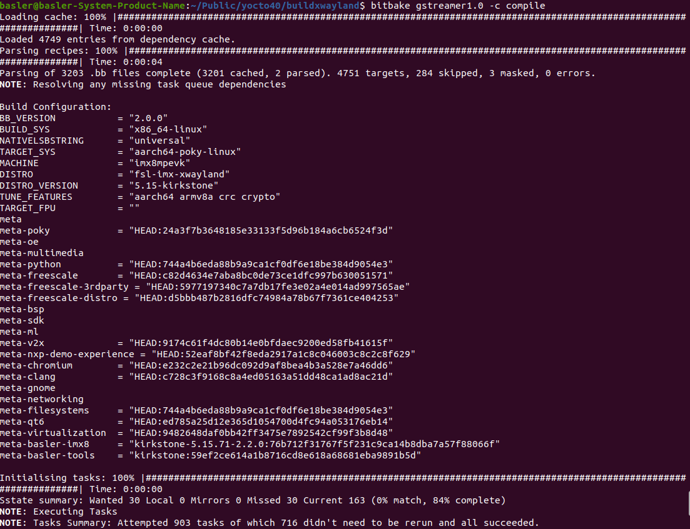
模組名字下錯時系統會提示, 但還是要自己判斷與測試是那一個名字.
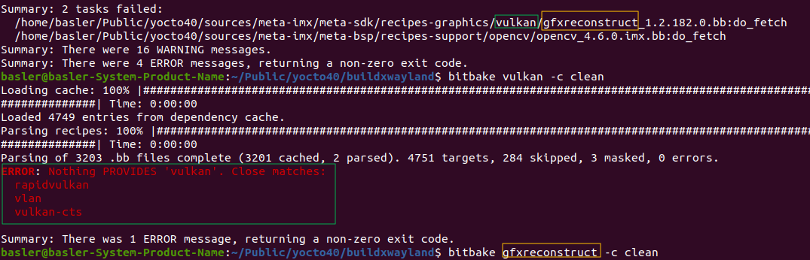
### Yocto BSP 燒錄方式
若已熟悉 Windows 與 Ubuntu 檔案之間的交握方式可略過此步驟.

在 Ubuntu 內下指令, 複製 wic.zst 與 bin-flash_evk 檔至其他位置, 避免手誤刪除.
```
cd < anywhere >
cp --recursive yocto-project-name/buildxwayland/tmp/deploy/images/imx8mpevk/*.wic.zst ./
cp --recursive yocto-project-name/buildxwayland/tmp/deploy/images/imx8mpevk/imx-boot-*.bin-flash_evk ./
```
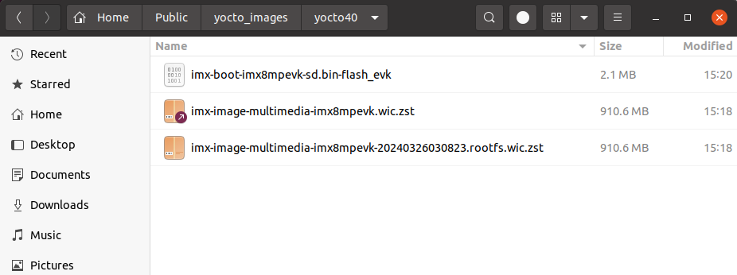

再透過其他方式將上圖檔案移動到 Windows, SCP, PSFTP, USB隨身碟.

#### 燒錄至eMMC
確認Boot Switch 開關撥片位置是否正確, 因要燒錄至eMMC, 斷電後調整至Serial Download `0001` .


下載 [UUU.exe](https://github.com/nxp-imx/mfgtools/releases) 並放置於與wic.zst & bin-flash_evk 檔同個路徑下

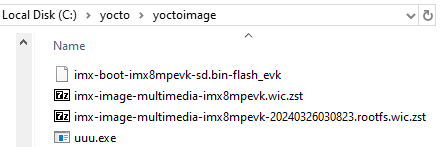

打開 PowerShell 執行指令.
```
cd < yocto images folder >
```
先將 iMX8MP 斷電後, Boot Switch 開關撥片調整至 Serial Download `0001` ,USB Type-C 接在 port 1 與電腦對接.
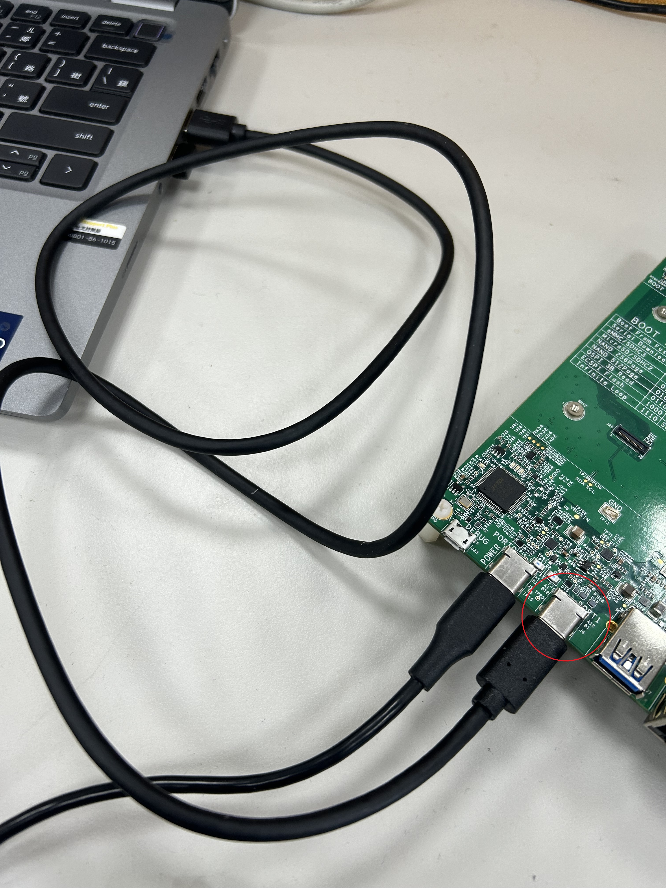 
iMX8MP啟動後, 輸入指令確認是否有連接成功.
```
.\uuu.exe -lusb
```
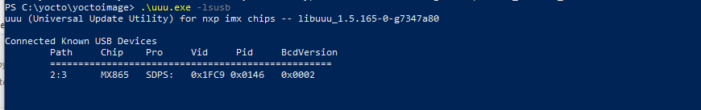 

確認連接成功後執行指令開始燒錄.
```
.\uuu.exe -b emmc_all imx-boot-imx8mpevk-sd.bin-flash_evk imx-image-multimedia-imx8mpevk.wic.zst
```
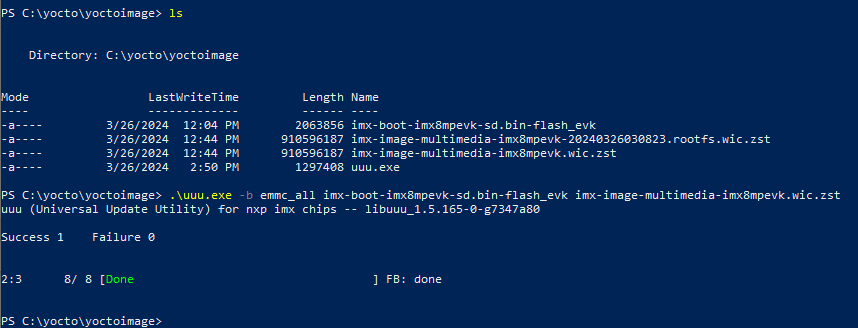 

將 iMX8MP 斷電後, 移除在Port 1處的 USB Type-C 並將 Boot Switch 開關撥片調整至 eMMC 0010, 開機看到畫面後點開 terminal 輸入指令打開 pylon.
```
pylon
```
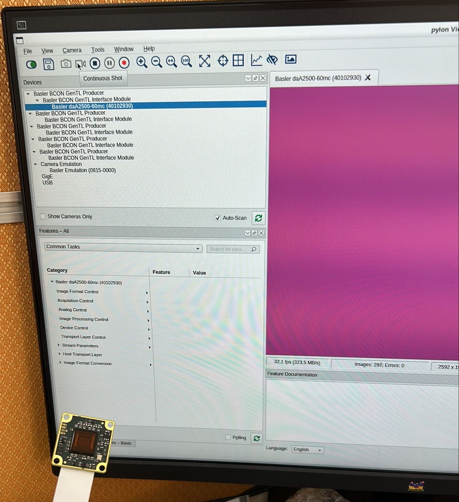 
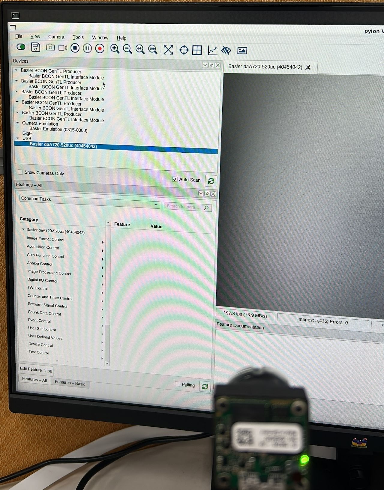 

## Referenc link
[【ATU Book - i.MX8系列 - OS】NXP i.MX Linux BSP 開發環境架設](https://www.wpgdadatong.com/blog/detail/74061)

[【ATU Book-i.MX8系列】 UUU（Universal Update Utility）](https://www.wpgdadatong.com/blog/detail/41709)

[meta-basler-tools](https://github.com/basler/meta-basler-tools)

[meta-basler-imx8](https://github.com/basler/meta-basler-imx8)

[How to set up camera Dart BCON Basler for iMX8MPlus on Embedded Linux](https://community.nxp.com/t5/i-MX-Processors-Knowledge-Base/How-to-set-up-camera-Dart-BCON-Basler-for-iMX8MPlus-on-Embedded/ta-p/1653408)

